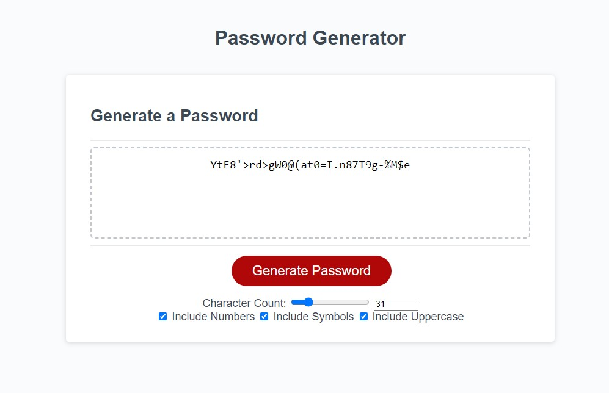

# Password Generator

## Application

This application generates a password for you. It has a drop-down menu that opens after clicking to generate a password. These options include numbers, symbols, uppercase, and character counts (8–128). Depending on your selections, a password will be generated based on them; if not, it defaults to lowercase.

## Photo

The following image shows the web application's appearance and functionality:

## Deployed Application

https://thomasjholtamiii.github.io/Password-Maker/

## Author

Thomas Holtam. Starter code without functionality was provided, and I added Javascript for function as well as some CSS and HTML to bind elements together and add a dropdown menu.